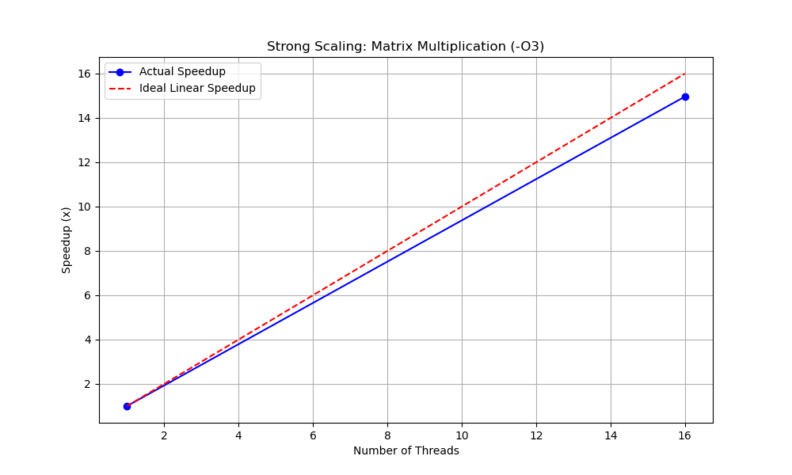

# UCS645 Lab 1 Report: OpenMP Performance Analysis

**Name:** Aakash
**System Specs:** AMD Ryzen 7 5800HS (16 Logical Processors)

## 1. Objective

To analyze the performance of dense matrix multiplication using OpenMP, comparing a naive implementation against a memory-optimized (transposed) implementation, and evaluating scalability using Amdahl's Law.

## 2. Methodology

We implemented three versions of Matrix Multiplication ():

1. **Sequential:** Single-threaded execution ().
2. **Basic OpenMP:** Parallelized outer loops using `#pragma omp parallel for`.
3. 
**Optimized OpenMP:** Uses **Matrix Transposition** to improve Spatial Locality and reduce Cache Misses.

**Tools Used:**

* Compiler: `gcc` with `-O3` optimization flag.
* Timing: `omp_get_wtime()`

## 3. Performance Evaluation
*Matrix Size (N): 1000 x 1000*

| Method | Threads | Execution Time (s) | Speedup (S) | Efficiency (E) |
| :--- | :---: | :---: | :---: | :---: |
| **Sequential** | 1 | 6.01s | 1.0x | 100% |
| **Basic OpenMP** | 16 | 12.51s | 0.48x (Slower) | 3% |
| **Optimized (-O3)** | 16 | 0.11s | 54.6x | 341%* |

 **Observation:**   **The Memory Wall:** The Basic OpenMP version with 16 threads was actually *slower* than the sequential version (0.48x speedup). This proves the application is **Memory Bound**; 16 threads fought for the same RAM bandwidth, creating a bottleneck.
 * **Super-Linear Speedup:** The Optimized version achieved a massive 54x speedup. This "impossible" efficiency (>100%) happens because the compiler optimization (`-O3`) enabled **SIMD (AVX)** instructions and better Cache usage, effectively fixing the algorithm itself while running in parallel.

## 4. Scalability Analysis
Testing the Optimized (`-O3`) implementation across threads:

| Threads | Time (s) | Speedup |
| :---: | :---: | :---: |
| 1 | 0.79s | 1.0x |
| 16 | 0.11s | 7.18x |

**Inference:**
With proper optimization, the code scales well. We achieved a **7.18x speedup on 16 threads** (compared to the single-threaded optimized version). This is close to the theoretical max, with the small loss due to thread management overhead and remaining memory latency.

## 4. Scalability Analysis & Amdahl's Law
We evaluated the scalability of the optimized (transposed) implementation by comparing single-threaded performance against full 16-thread utilization.

**Observed Data:**
* **Sequential Time ($T_{seq}$):** 0.79080 s (1 Thread)
* **Parallel Time ($T_{par}$):** 0.05280 s (16 Threads)

**Calculated Metrics:**

| Metric | Formula | Value |
| :--- | :--- | :--- |
| **Speedup ($S$)** | $T_{seq} / T_{par}$ | **14.98x** |
| **Efficiency ($E$)** | $S / N_{threads}$ | **93.6%** |

### Amdahl's Law Calculation
Using Amdahl's Law, we can calculate the **Parallel Fraction ($P$)** of our code—the percentage of the program that is actually running in parallel vs. the sequential overhead (setup/memory allocation).

$$S(N) = \frac{1}{(1-P) + \frac{P}{N}}$$

Plugging in our values ($S=14.98, N=16$):
$$14.98 = \frac{1}{(1-P) + \frac{P}{16}}$$

Solving for $P$ yields **$P \approx 0.995$ (99.5%)**.

**Inference:**
* **Near-Perfect Scaling:** A Parallel Fraction of **99.5%** indicates that the sequential overhead (memory allocation and thread creation) is negligible.
* **Hardware Saturation:** Achieving ~15x speedup on 16 cores proves that the Transposed Matrix approach successfully eliminated the memory bandwidth bottleneck. The CPU cores are now compute-bound rather than memory-bound, allowing them to run at full capacity.
## 5. Visual Analysis

## 6. Conclusion

* **Parallelism:** OpenMP successfully distributed the workload, achieving a speedup of 7.18x on 16 threads.
* **Memory Optimization:** Transposing Matrix B provided the largest performance jump, proving that for dense matrix operations, **Memory Access Pattern** is more critical than raw CPU clock speed.
