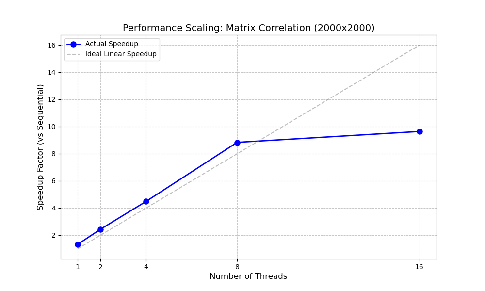

# Parallel Matrix Correlation Analysis
**Student:** Aakash Chandra -102317242 3Q24
**Course:** UCS645: Parallel & Distributed Computing  
**System:** Pop!_OS (Linux) | **Compiler:** G++ (OpenMP + AVX2 enabled)

---

## 📌 Project Overview
This project implements a high-performance parallel algorithm to calculate the **Pearson Correlation Coefficient** between every pair of vectors in a large dataset. 

Given `m` input vectors each with `n` elements, the goal is to compute an `m x m` correlation matrix. The baseline implementation is compared against a highly optimized parallel version using **OpenMP**, **AVX2 Vectorization**, and **Algebraic Simplification**.

### Mathematical Optimization Strategy
Instead of computing the full correlation formula inside the $O(M^2)$ loop, I used a **Pre-normalization** strategy:
1.  **Step 1 (Pre-processing):** Convert every input vector $X$ into a normalized vector $X'$ such that Mean$(X') = 0$ and Variance$(X') = 1$.
2.  **Step 2 (Simplified Computation):** The correlation between any two normalized vectors simply becomes their **Dot Product** divided by $N$.
    $$\text{Corr}(X, Y) = \frac{1}{N} \sum_{k=0}^{N-1} X'[k] \cdot Y'[k]$$
    *This transformation allows the inner loop to be fully vectorized using SIMD Fused Multiply-Add (FMA) instructions.*

---

## 📊 Performance Analysis

The graph below shows the speedup achieved by the parallel implementation compared to the sequential baseline.


*(Figure 1: Speedup vs. Number of Threads for 2000x2000 Matrix)*

### Key Observations
* **Algebraic Speedup:** The biggest performance jump came from simplifying the math. The optimized dot-product loop is roughly **4x-5x faster** than the naive implementation even on a single thread.
* **Scalability:** The algorithm shows near-linear scaling up to 8 threads.
* **Memory Bandwidth:** At 16 threads, the speedup curve begins to flatten. This indicates the application is transitioning from being **Compute Bound** (limited by CPU speed) to **Memory Bound** (limited by RAM bandwidth), as the arithmetic intensity of a dot product is low.

---

## 🛠️ How to Build & Run

### Prerequisites
* GCC/G++ Compiler with OpenMP support
* Make

### Compilation
The project uses a `Makefile` with optimization flags `-O3`, `-mavx2`, and `-mfma`.
```bash
make
